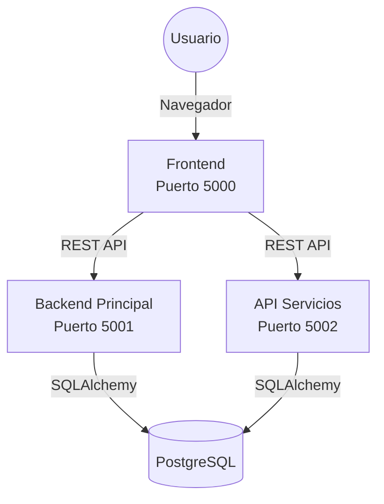

# Banco Pichincha - Sistema Bancario Integrado

Sistema bancario completo desarrollado con arquitectura de microservicios en Python (Flask).

## 🏗️ Arquitectura

El sistema se compone de 3 servicios principales que se ejecutan independientemente:



1.  **Frontend (5000):** Interfaz web para el usuario (Flask + Jinja2).
2.  **Backend (5001):** API Principal para gestión de usuarios, cuentas y transacciones.
3.  **API Servicios (5002):** Microservicio dedicado para pagos de servicios externos (Agua, Luz, SRI, etc.).

---

## 🚀 Requisitos Previos

- Python 3.10+
- PostgreSQL 12+
- Acceso a Internet (para instalar paquetes)

---

## 🛠️ Instalación y Configuración

Sigue estos pasos para configurar el proyecto desde cero:

### 1. Configurar Base de Datos
Asegúrate de tener un servidor PostgreSQL corriendo.
1. Crea una base de datos llamada `banco_pichincha`.
2. Ejecuta el script SQL `database/schema.sql` para crear las tablas.

### 2. Configurar Entorno
Crea los archivos `.env` en cada carpeta (`backend`, `frontend`, `services_api`) basándote en los `.env.example`.

**Ejemplo de `.env` para Backend y Services:**
```ini
DB_HOST=192.168.100.12
DB_PORT=5432
DB_NAME=banco_pichincha
DB_USER=tu_usuario
DB_PASSWORD=tu_password
```

### 3. Instalar Dependencias
Debes instalar las librerías para CADA servicio:

```bash
# Frontend
cd frontend
pip install -r requirements.txt

# Backend
cd ../backend
pip install -r requirements.txt

# Services API
cd ../services_api
pip install -r requirements.txt
```

### 4. Poblar Datos (Opcional)
Para tener usuarios y datos de prueba:

```bash
cd backend
python seed_backend.py    # Crea usuarios y cuentas
python seed_extra_data.py # Crea cajeros y empresas

cd ../services_api
python seed_data.py       # Crea tipos de servicio y pagos
```

---

## ▶️ Ejecución

### Método Automático (Windows)
Simplemente ejecuta el archivo raíz:
```cmd
iniciar.bat
```
Esto abrirá 3 terminales y levantará todos los servicios.

---

## 👤 Usuarios de Prueba

| Nombre        | Usuario (Correo)             | Contraseña | Rol     |
| :------------ | :--------------------------- | :--------- | :------ |
| Carlos Garcia | `carlos.garcia0@example.com` | `1234`     | Cliente |
| Juan Torres   | `juan.torres1@example.com`   | `1234`     | Cliente |
| Supermaxi     | `contacto0@empresa.com`      | `admin123` | Empresa |

---

## 📂 Estructura del Proyecto

- `/backend`: Lógica de negocio principal (Cuentas, Tarjetas, Transacciones).
- `/frontend`: Interfaz gráfica (HTML/CSS/JS).
- `/services_api`: Lógica para pagos de servicios (Luz, Agua, Multas).
- `/database`: Scripts SQL.
